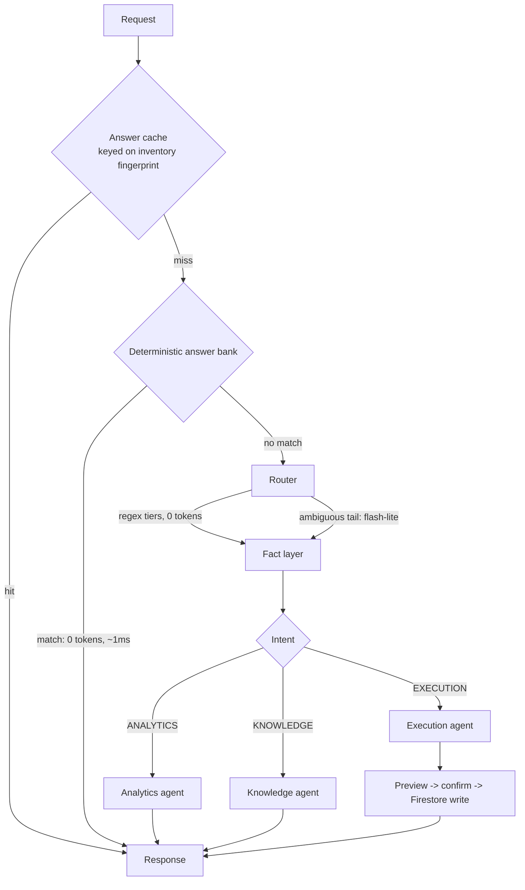

# SmartShelfKart — Inventory Agent Backend

> [!WARNING]
> **Security Gap**: The Cloud Run service `rag_backend` must verify a Firebase ID token and derive `companyId` from the token's claims, rather than relying on a client-supplied `x-company-id` header. Currently, any client can access any tenant's data by spoofing this header. The client has been updated to send the `Authorization: Bearer <idToken>` header, but the backend enforcement is out of scope for this repository and must be implemented on the Cloud Run side.

The assistant answers questions about live inventory, and executes stock changes
on request. It is built around one principle: **inventory is structured,
relational, numeric data, so the agent queries it rather than retrieving it.**

Vector search is deliberately absent from the request path. Embedding a stock
table and hoping cosine similarity surfaces the right row is strictly worse than
reading the row. A small optional doc store remains available for genuine prose
(policies, how-tos) — the one thing retrieval is actually good at here.

---

## 1. Request flow



---

## 2. The fact layer (`facts.py`)

Everything the agent says is grounded in an `InventoryFacts` snapshot, built per
company and TTL-cached (45s by default).

**Sources** — pulled from Firestore in parallel:
- `companies/{id}/products` — live stock, held quantity, thresholds, prices
- `companies/{id}/transactions` — the last 90 days of stock movements
- `companies/{id}/vendors` — real supplier lead times

**Derived per product:**

| Field | How |
| :--- | :--- |
| `daily_burn_rate` | stock-out units over the window ÷ window days |
| `demand_std_dev` | true σ of daily out-quantities, zero-days included |
| `days_of_supply` | quantity ÷ burn rate |
| `available_qty` | quantity − heldQuantity (stock the app has already reserved) |
| `lead_time_days` | joined from the product's preferred vendor |
| `safety_stock` | Z × σ × √(lead time), Z = 1.65 for a 95% fill rate |
| `reorder_point` | burn × lead time + safety stock |
| `health` | at_risk / dead_stock / overstocked / optimal |

The burn-rate and health math deliberately mirrors
`lib/services/report_analytics_service.dart::computeInventoryHealthForecasts`,
so the assistant and the app's Reports screen quote identical numbers.
`test_facts.py` asserts that parity.

> Before this existed, `sales_velocity` was read from a product field the app
> never writes, so it was `0.0` for every SKU. Every forecast, reorder
> suggestion, ABC classification and stockout projection was computed on zeros.

**Fingerprint.** Each snapshot carries a content hash of the inventory state.
The answer cache keys on it, so any stock change rotates the key on every
instance at once — staleness is structurally impossible rather than
TTL-dependent.

---

## 3. Product resolution (`resolver.py`)

One ranked matcher shared by chat, voice, and visual audit: exact barcode →
exact name → normalised name → IDF-weighted token overlap → fuzzy ratio.

**Ambiguity is a first-class outcome.** When two products score within a hair of
each other, the agent asks which one rather than guessing. Words that nearly
every product shares ("standard", "basic") carry no identifying weight.

> The three matchers this replaced each picked the first product whose name
> contained a query word — which is how "add 50 cannula" silently updated
> Cannula 18G when the user meant 20G.

---

## 4. Answering, cheapest path first

1. **Answer cache** — fingerprint-keyed, so hits are frequent and never stale.
2. **Deterministic bank** (`deterministic.py`) — audits, reorder lists, low
   stock, dead stock, valuations, stockout projections, top-N, single-SKU
   lookups. Zero tokens, about a millisecond, cannot hallucinate a number. In
   practice this serves the large majority of real questions.
3. **Router** — regex tiers cost nothing; only the genuinely ambiguous tail
   reaches a flash-lite classifier, and those classifications are cached.
4. **Agents** — `gemini-2.5-flash` with structured tools over the fact layer.

### Model tiers (`llm.py`, all env-overridable)

| Tier | Default | Used for |
| :--- | :--- | :--- |
| `ROUTER_MODEL` | `gemini-2.5-flash-lite` | intent classification, disambiguation |
| `AGENT_MODEL` | `gemini-2.5-flash` | analytics, execution, tool calling |
| `HEAVY_MODEL` | `gemini-2.5-pro` | opt-in, multi-step strategic asks |

`GET /api/cache/stats` reports per-tier call and token counts, and which
provider actually served requests.

### Context budget
- History capped at 6 turns with rendered tables stripped (one audit table runs
  to hundreds of tokens; ten turns of them crowd out the live data).
- Product context is resolver-bounded, not "the whole catalog".

---

## 5. Writes (`writes.py`)

Mutations go straight to Firestore against the product's real document id,
inside a transaction, so concurrent updates cannot lose each other or drive
stock negative.

**Confirm before write.** A mutation produces a preview card and a structured
pending action held server-side against `(company_id, session_id)`. Confirming
executes exactly what was previewed.

> This replaces a flow that rendered a markdown table and then, on the next
> turn, scraped its own rendered output back out with regexes to decide what to
> execute.

Transaction documents are written with the field names the app actually reads
(`date`, `userId`, `userName`, `reason`) — the previous `timestamp` /
`performedBy` shape meant AI movements carried the wrong date, no attribution,
and polluted the ledger the fact layer now derives demand from.

Guardrails (`guardrails.py`) validate quantity ceilings, spend limits and
negative-stock floors *before* the preview is shown.

---

## 6. Streaming

`/api/chat/stream` forwards real model tokens as they arrive via
`astream_events`, so time-to-first-token is a few hundred milliseconds. The
graph is async end to end; blocking Firestore reads are pushed off the event
loop with `asyncio.to_thread`.

Deterministic answers and confirmation previews never touch a model, so they are
emitted directly. `[STATS:…]` and similar machine-readable trailers are kept out
of the visible token stream and delivered only in the final `answer`.

---

## 7. Tests

| Suite | Covers |
| :--- | :--- |
| `test_facts.py` | burn rate, σ, days of cover, health quadrants, ATP, fingerprints — asserts Dart parity |
| `test_resolver.py` | ambiguity, barcode precedence, natural phrasing, rejection of nonsense |
| `test_cache.py` | hits, fingerprint invalidation, tenant isolation, mutations never cached |
| `test_pipeline.py` | routing, execution context, deterministic answers, confirm/cancel flow |
| `test_api_server.py` | endpoint contracts, SSE, guardrail rejection |
| `test_phase2/3/4` | swarm, predictive ML, voice and visual audit |

`deploy_backend.sh` runs the first five and aborts the deploy on failure.

---

## 8. Deployment

Cloud Run, `asia-south1`, `--min-instances=1` (no cold starts) and `--cpu-boost`.
Set `GEMINI_API_KEY` explicitly rather than relying on the fall-through to
Vertex, so provider attribution is unambiguous.

## Super admin

Platform-wide administration (the `/super-admin` dashboard) is gated on a
document existing at:

```
superAdmins/{uid}
```

The document's contents are irrelevant — the security rules only test that it
exists (`isSuperAdmin()` in `firestore.rules`). Any field will do, e.g.
`{ note: 'founder' }`.

**Nothing in the app can create this document.** `/superAdmins` is
`allow write: if false` for every client, including existing super admins, so
the only ways to grant it are the Firebase console or the Admin SDK. That is
deliberate: it is the one privilege that crosses the tenant boundary, so it
must not be grantable by anything a compromised session could reach.

To grant it, add the document by hand in the console under the user's auth uid.
To revoke, delete the document — it takes effect on their next request, with no
sign-out required.

A super admin holds full read/write over every company, via a single scoped
wildcard (`match /companies/{companyId}/{document=**}`) at the end of the
companies block. That rule sits outside `companyActive()`, so a suspended
workspace can always be reactivated.

## Company lifecycle and plans

Company docs carry two fields the app treats as optional, because every company
created before this feature has neither:

- `status` — `active` (default when absent) | `suspended` | `deleted`.
  `companyActive()` in the rules blocks **writes** for anything not active.
  Reads are deliberately left alone: rules `get()` calls are billed as document
  reads, and gating reads too would be a large across-the-board cost for a
  control that only needs to stop new data. A suspended tenant keeps read
  access to its own books and is shown the reason.
- `plan` — `{ planId, status, startedAt, note }`, defaulting to the free plan
  when absent. **Nothing enforces a plan today**; `PlanDefinition.limits` is
  carried but read by nothing. Paid tiers are added to `PlanCatalog`
  (`lib/models/company_plan_model.dart`) and need no data migration.

Deleting a company from the dashboard is a *soft* delete (sets `status`), which
is reversible. The irreversible purge is a separate action, only reachable once
a workspace is already deleted, and both require typing the workspace name.
There are no backups configured on this project.
