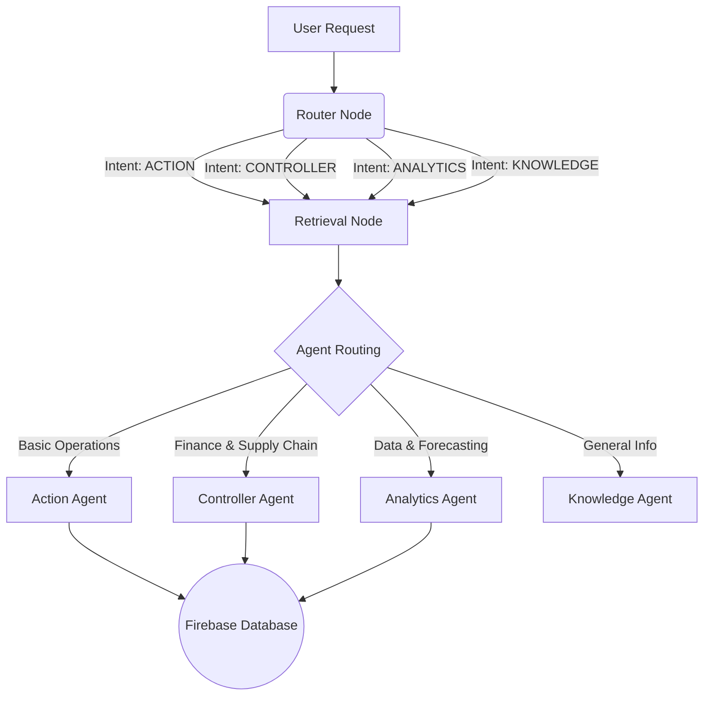

# 🧠 SmartShelfKart: Autonomous Backend Architecture

Welcome to the technical design document for the **SmartShelfKart Backend**. This system goes far beyond a simple API; it is a **multi-agent, autonomous workflow engine** powered by LangGraph, Google Vertex AI (`gemini-1.5-pro`), and Firebase.

This document outlines the system's core capabilities, the flow of intelligence, and the specialized agents that drive warehouse operations and financial health.

---

## 🌟 1. System Overview

At the heart of the system lies a **LangGraph StateGraph**, which orchestrates a team of specialized AI agents. Instead of relying on a single, massive prompt that degrades over time, incoming requests are intelligently routed to highly specialized "expert" nodes based on intent.

> [!TIP]
> **Why LangGraph?**  
> By using a graph-based state machine, we can maintain strict control over agent loops, prevent infinite loops, and inject custom guardrails before executing physical database mutations.

### Tech Stack
- **Orchestration**: LangGraph / LangChain
- **Intelligence**: Google Vertex AI (`gemini-1.5-pro`)
- **Database / State**: Firebase Firestore
- **Deployment**: Google Cloud Run (Serverless, Auto-scaling)
- **API Protocol**: FastAPI (HTTP / Server-Sent Events for streaming)

---

## 🚦 2. The Intelligence Pipeline

Every query entering the `/api/chat` endpoint travels through a strict, multi-stage pipeline.

### Stage 1: The Router Node
Before engaging expensive LLMs, the **Router Node** acts as the gatekeeper. It uses a hybrid approach:
1. **Instant Regex Matching**: For commands like *"add 50 units"* or *"what is our cash flow"*, it instantly flags the intent.
2. **LLM Classification (Fallback)**: If the request is ambiguous, a fast, zero-temperature LLM call classifies the intent perfectly.

### Stage 2: The Retrieval Node
Context is king. Before any agent thinks, the system queries the **Inventory DB** to fetch real-time state. This guarantees **Zero Hallucination**—the AI always knows exactly what is currently sitting on the warehouse shelves before it speaks.

---

## 🤖 3. The Autonomous Agents (The Swarm)

Once the context is loaded and the intent is known, the request is handed to one of our highly specialized AI personas.

### A. The Action Agent 🛠️
**Role:** The Warehouse Worker.
**Purpose:** Handles direct, unambiguous commands (e.g., *"Restock 50 units of Cannula"*). It maps directly to basic Firebase mutations without overthinking.

### B. The Controller Agent 📈 (The Star)
**Role:** Autonomous Operations & Finance Controller.
**Purpose:** Acts as a bridge between warehouse ops and corporate finance. It uses the strict **ReAct Framework** (Thought → Action → Observation → Final Answer) to analyze situations before acting.
**Core Directives:**
- **Financial Grounding**: Treats every physical move as a financial event, calculating Working Capital impacts.
- **Proactive Execution**: Detects anomalies and automatically drafts Purchase Orders to prevent stockouts.
- **Tools Equipped:**
  - `query_inventory_state`: Fetches exact stock and thresholds.
  - `predict_demand_velocity`: ML-based 30-day forecasting.
  - `draft_purchase_order`: Generates POs with safety guardrails.
  - `simulate_financial_impact`: Calculates margins and capital tied up.
  - `detect_anomalies`: Scans for shrinkage and deadstock.

> [!IMPORTANT]  
> The Controller Agent is forbidden from guessing. It *must* invoke its tools to fetch live data before drafting a Purchase Order.

### C. The Analytics Agent 📊
**Role:** The Data Scientist.
**Purpose:** Handles queries requiring deep data manipulation, ABC analysis, historical trend reporting, and complex ledger audits.

### D. The Knowledge Agent 📚
**Role:** The General Assistant.
**Purpose:** Handles standard Q&A, greetings, and queries that don't require database mutations or complex math.

---

## 🛡️ 4. Security & Guardrails

We do not let autonomous AI run wild. The backend implements strict guardrails:
1. **Validation Checks**: When the Controller drafts a Purchase Order, the `guardrails.validate_action()` function intercepts the request. It ensures the reorder quantity does not exceed maximum capacity constraints.
2. **Read-Only vs Write Tools**: Only specific agents are given tools capable of mutating the database.
3. **IAM Constraints**: The Google Cloud Run service account is strictly scoped to its specific Firestore instance.

---

## 🚀 5. Deployment Architecture

> [!NOTE]  
> The backend is fully containerized and runs entirely serverless.

1. **Docker Container**: Packages the LangGraph pipeline and Python dependencies.
2. **Google Cloud Run**: Automatically scales from 0 to N instances based on API traffic. Handles HTTPS termination and routing securely.
3. **Continuous Integration**: The `deploy_backend.sh` script automates the build and traffic routing seamlessly.
