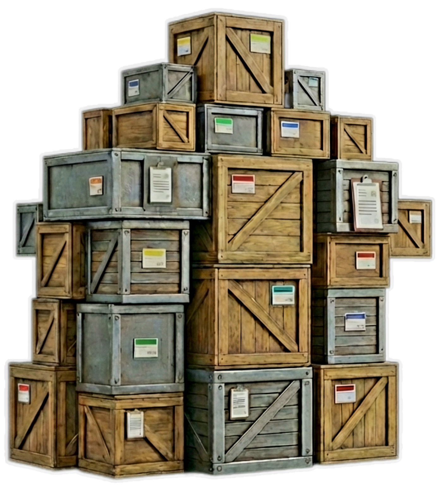

<div align="center">
  
  
  # SmartShelfKart
  **Intelligent, Cross-Platform Inventory & Stock Management**

  [](https://flutter.dev)
  [](https://firebase.google.com/)
  [](https://aistudio.google.com/)
  
  ---

  ### 🌐 [Try the Web App Live](https://smartshelfkart.com/)
  ### 📱 [Get it on Google Play](https://play.google.com/store/apps/details?id=com.stockmanager.stock_management&pcampaignid=web_share)
  
  ---
</div>

## 📖 Overview

**SmartShelfKart** is a state-of-the-art stock and inventory management platform designed to help modern businesses track, manage, and optimize their operations. Built completely from the ground up using **Flutter** and powered by a robust **Firebase** backend, SmartShelfKart delivers blazing-fast performance across Web, Android, and iOS.

What truly sets SmartShelfKart apart is **Nova**—our integrated AI Assistant. Powered by a **LangChain & Python RAG backend** utilizing **Google Gemini**, Nova acts as an intelligent ledger that can instantly execute complex inventory commands, answer analytics questions, and assist with real-time stock adjustments through natural language.

---

## ✨ Key Features

- 🤖 **Nova AI Assistant (RAG Engine)**
  - Chat seamlessly with your inventory using natural language (supports English & Hinglish).
  - Smart intent routing instantly categorizes questions into "Analytics" vs. "Actionable Tasks".
  - Automated barcode extraction allows Nova to automatically trigger UI action cards (e.g., adding/deducting stock) directly from the chat interface without manual clicking.
  
- 📊 **Real-Time Analytics Dashboard**
  - Instantly view critical metrics: Total Products, Low Stock Alerts, Out of Stock, Pending Sales, and Purchase Orders.
  - Beautiful, dynamic charting using `fl_chart`.

- 📦 **End-to-End Inventory Control**
  - Create, manage, and categorize products with advanced SKU/Barcode tracking.
  - Set Custom Low-Stock Thresholds to proactively trigger restocking alerts.

- 🧾 **Order & Invoice Management**
  - Track complete lifecycles for **Sales Orders** and **Purchase Orders**.
  - Generate and manage professional invoices dynamically.

- 🔒 **Role-Based Access Control (RBAC)**
  - Enterprise-grade staff permissions.
  - Secure authentication flows managed by Firebase Auth.

---

## 🛠️ Technology Stack

### Frontend (Mobile & Web)
- **Framework:** Flutter (Dart)
- **State Management:** Provider
- **UI Architecture:** Custom Glassmorphism Theme, Responsive Layout Builder
- **AI UI:** `flutter_markdown` for beautiful tabular data rendering, `speech_to_text` for voice commands.

### Backend & Infrastructure
- **Database:** Firebase Cloud Firestore
- **Authentication:** Firebase Auth
- **Hosting:** Firebase Hosting (Web), Google Play Console (Android)
- **Storage:** Firebase Cloud Storage

### AI Microservice (`rag_backend`)
- **Framework:** Python, LangGraph
- **LLM:** Google Gemini (`gemini-3.1-flash-lite` for operations, `gemini-3.5-flash` for deep analytics)
- **Embeddings & Vector Store:** Google Generative AI Embeddings, ChromaDB
- **Deployment:** Docker container deployed on Google Cloud Run

---

## 🚀 Getting Started

Follow these steps to run SmartShelfKart locally.

### Prerequisites
- [Flutter SDK](https://docs.flutter.dev/get-started/install) (version 3.10.7+)
- Python 3.11+ (if you wish to run the RAG backend locally)
- A Firebase Project (for Auth and Firestore setup)

### 1. Setup the Flutter Client
```bash
# Clone the repository
git clone https://github.com/himanshudixit2002/stock_management.git
cd stock_management

# Install dependencies
flutter pub get

# Run the app (Android/iOS/Web)
flutter run
```

### 2. Setup the AI Backend (Optional)
```bash
# Navigate to the backend directory
cd rag_backend

# Create and activate a virtual environment
python3 -m venv venv
source venv/bin/activate  # On Windows use `venv\Scripts\activate`

# Install requirements
pip install -r requirements.txt

# Create an environment file and add your Gemini API Key
cp .env.example .env

# Run the backend locally
uvicorn main:app --reload --port 8000
```

---

## 🤝 Contributing
Contributions are always welcome! If you have ideas for new features or find any bugs, feel free to open an issue or submit a pull request.

---

## 📄 License
This project is proprietary and built for SmartShelfKart. 

<div align="center">
  <i>Built with ❤️ using Flutter & AI</i>
</div>
