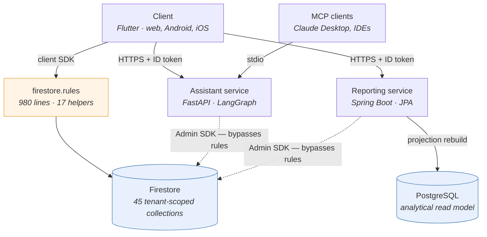
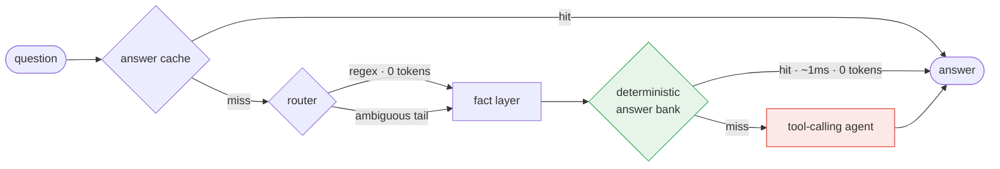

<div align="center">
  

  # SmartShelfKart

  **A multi-tenant inventory platform with an AI assistant that refuses to guess.**

  [](https://github.com/himanshudixit2002/stock_management/actions/workflows/ci.yml)
  [](#testing)
  [](reporting_service/)
  [](rag_backend/)
  [](https://flutter.dev)
  [](reporting_service/)

  **[Live app](https://smartshelfkart.com/app)** · **[Google Play](https://play.google.com/store/apps/details?id=com.stockmanager.stock_management)** · **[Architecture reference (PDF)](SmartShelfKart-Architecture.pdf)** · **[Platform notes](PLATFORM.md)**

</div>

---

## What this is

Inventory software for real businesses — 51 modules covering purchasing, sales,
warehousing, light manufacturing, service jobs and the financial reporting that
falls out of them. It runs in production on the web and Google Play.

The part worth reading is the assistant. You can ask it *"what's running low"* or
*"add 50 units of the blue widgets"*, and it answers from the ledger rather than
from a language model's impression of the ledger. **76% of benchmark queries never
reach a model at all** — they are database questions, and they get database answers
in about a millisecond.

Everything below is what it took to make that trustworthy.

---

## Architecture

Four runtimes, with a deliberate imbalance in how much each is trusted.


```mermaid
flowchart TD
    C["Client<br/><i>Flutter · web, Android, iOS</i>"]
    R["firestore.rules<br/><i>980 lines · 17 helpers</i>"]
    FS[("Firestore<br/><i>45 tenant-scoped collections</i>")]
    A["Assistant service<br/><i>FastAPI · LangGraph</i>"]
    RS["Reporting service<br/><i>Spring Boot · JPA</i>"]
    PG[("PostgreSQL<br/><i>analytical read model</i>")]
    M["MCP clients<br/><i>Claude Desktop, IDEs</i>"]

    C -->|"client SDK"| R --> FS
    C -->|"HTTPS + ID token"| A
    C -->|"HTTPS + ID token"| RS
    M  -->|"stdio"| A
    A  -.->|"Admin SDK — bypasses rules"| FS
    RS -.->|"Admin SDK — bypasses rules"| FS
    RS -->|"projection rebuild"| PG

    style R fill:#fff4e6,stroke:#e8a33d
    style FS fill:#e8f0fe,stroke:#4a7fb5
    style PG fill:#e8f0fe,stroke:#4a7fb5
```

| Runtime | Responsibility | Trusted? |
|---|---|---|
| **Client** (Flutter) | All user interaction; reads and writes Firestore directly | No — every write is re-checked by rules |
| **Firestore + rules** | System of record, and the primary authorization boundary | Rules are authoritative for the client SDK |
| **Assistant** (Python) | Natural-language Q&A and agent-driven writes | Runs on the Admin SDK, which **bypasses rules** — so it re-implements them |
| **Reporting** (Java) | Tax, aging, P&L over a PostgreSQL projection | Same — and read-only with respect to business data |

> The dotted arrows are the whole security story. The Admin SDK ignores
> `firestore.rules` completely, so **both** back-end services re-implement the
> authorization model — 117 permission keys, resolved the same way the rules
> resolve them. Miss that and the assistant becomes a way around every permission
> in the product.

---

## How the assistant answers

A question is filtered through progressively more expensive layers. Most questions
never reach the last one.


```mermaid
flowchart LR
    Q([question]) --> CA{answer cache}
    CA -->|hit| OUT([answer])
    CA -->|miss| RT{router}
    RT -->|"regex · 0 tokens"| F[fact layer]
    RT -->|"ambiguous tail"| F
    F --> DB{deterministic<br/>answer bank}
    DB -->|"hit · ~1ms · 0 tokens"| OUT
    DB -->|miss| AG[tool-calling agent]
    AG --> OUT

    style DB fill:#e6f4ea,stroke:#34a853
    style AG fill:#fce8e6,stroke:#d93025
```

The cache key includes a **content hash of live inventory**, so any stock change
anywhere rotates the key on every instance with no invalidation message. Stale
answers become unreachable rather than needing eviction.

---

## Decisions worth reading

Five calls that look odd until you know why.

<table>
<tr><th align="left" width="34%">Decision</th><th align="left">Reasoning</th></tr>

<tr><td><strong>No vector search.</strong> RAG was removed from the request path.</td>
<td>Inventory is structured, relational, numeric data. <em>"How many units of SKU 89010001 do I have"</em> has an exact answer a query returns exactly; embedding the stock table and hoping cosine similarity surfaces the right row is strictly worse — slower, dearer, and capable of returning a confidently wrong neighbour. And no amount of nearest-neighbour search computes a <code>SUM</code>.</td></tr>

<tr><td><strong>Money is <code>BIGINT</code> minor units</strong>, never a float.</td>
<td>A <code>DOUBLE</code> column accumulates error across a quarter and eventually reports a tax total of <code>4999.999999997</code>. The conversion happens once, at the sync boundary, using <code>BigDecimal.valueOf</code> — <code>new BigDecimal(19.99)</code> takes the exact binary value and yields <strong>1998</strong> paise instead of 1999. There is a test pinning that number.</td></tr>

<tr><td><strong><code>company_id</code> leads every primary key and index.</strong></td>
<td>Tenancy is the physical layout, not a filter the application remembers to apply — so a query that forgets it is simultaneously a tenancy bug <em>and</em> a full table scan, and gets caught in review rather than in an incident.</td></tr>

<tr><td><strong>Every write is preview → confirm.</strong></td>
<td>One place to check permission, one place to commit, one place where a refusal is final. A refusal cannot be routed around by rewording the request.</td></tr>

<tr><td><strong>The sync is a full rebuild</strong>, not an incremental merge.</td>
<td>Incremental sync of a document store means detecting deletes, which Firestore will not tell you about after the fact — a deleted invoice would linger in the projection forever and quietly inflate every report. A rebuild is a few thousand rows in one transaction: all or nothing.</td></tr>
</table>

---

## Grading the assistant

Unit tests answer *"does this function still return 4"*. They do not answer the
question that decides whether an inventory assistant is shippable: **when the
prompt changes, does it still quote real numbers about real products?**

```bash
cd rag_backend && venv/bin/python run_evals.py
```

21 golden cases across four suites — routing, grounding, safety, edge cases —
running **offline, with no API key and zero tokens.** Two ideas make that possible:

**Ground truth is computed by hand.** Expected values are arithmetic written out
in `evals/catalogs.py`, not read back from the code under test. An eval that
derives its expectation from the system it grades proves only that the system
agrees with itself.

**The model's decision is scripted; everything downstream of it is real.** Every
stock change begins with the agent choosing a tool, and that choice is the model's.
So `evals/fake_llm.py` replays a fixed tool call and lets the permission check,
resolver, pending store and ledger write run for real. The half that is faked is
the half that costs money; the half that is real is the half that has bugs.

That is what lets this pair run on every push, for nothing:

```yaml
- id: write_lands_for_a_permitted_caller     # apples 15 → 65
  permissions: ["canAdjustStock"]
  expect: { writes: [update_stock], stock_after: {"89010001": 65} }

- id: write_refused_without_the_permission   # apples stay at 15
  permissions: []
  expect: { refuses: true, stock_after: {"89010001": 15} }
```

Same words, same script, same confirmation. **The grant is the only difference,
and it has to be the whole difference.**

The suite also gates on **deterministic coverage** — the share of cases answered
with no model call, currently **76.2%**. No correctness test catches the
regression that protects against: route a free question through the agent and the
answer stays right while the bill grows for the life of the product.

And `test_evals.py` hands every scorer a turn it must reject, because a suite that
has never failed is not evidence the agent is correct — it is evidence of nothing.

---

## Features

51 modules. Collapsed so they do not bury the engineering above — expand for the
full list.

<details>
<summary><b>Show all features</b> — inventory, purchasing, sales, manufacturing, service, finance, governance</summary>

<br>

- 🤖 **Nova AI Assistant (RAG Engine)**
  - Chat seamlessly with your inventory using natural language (supports English & Hinglish).
  - Smart intent routing instantly categorizes questions into "Analytics" vs. "Actionable Tasks".
  - Automated barcode extraction allows Nova to automatically trigger UI action cards (e.g., adding/deducting stock) directly from the chat interface without manual clicking.
  
- 📊 **Real-Time Analytics Dashboard**
  - Instantly view critical metrics: Total Products, Low Stock Alerts, Out of Stock, Pending Sales, and Purchase Orders.
  - Beautiful, dynamic charting using `fl_chart`.

- 📦 **End-to-End Inventory Control**
  - Create, manage, and categorize products with advanced SKU/Barcode tracking.
  - Set Custom Low-Stock Thresholds to proactively trigger restocking alerts.

- 🧾 **Order & Invoice Management**
  - Track complete lifecycles for **Sales Orders** and **Purchase Orders**.
  - Generate and manage professional invoices dynamically.

- 🔒 **Role-Based Access Control (RBAC)**
  - Enterprise-grade staff permissions.
  - Secure authentication flows managed by Firebase Auth.

- 🏭 **Manufacturing & Assembly**
  - Define a finished product as a bill of materials, with per-component wastage.
  - Build and unbuild in one atomic movement — components out, finished goods in, never half-done.

- 🔖 **Serial Number Tracking**
  - Track individual units below the batch, with status, location and a full movement history.
  - Warranty dates and case-insensitive lookup, for RMA and recall work.

- 🚚 **Transfer Orders with In-Transit Stock**
  - Draft → dispatched → received, with partial receipts and shortage reporting.
  - Stock in a truck sits in an explicit in-transit bucket, so totals reconcile the whole way.

- 📝 **Purchase Requisitions & Approvals**
  - Ask for stock without committing company money; approval is its own permission.
  - Approved requests convert straight into a draft purchase order.

- 🧮 **Tax (GST) Summary**
  - Output and input tax by rate for a month, quarter or financial year, with the net position.

- 🔁 **Recurring Invoices**
  - Templates on a weekly-to-yearly cadence; generating is idempotent, so nobody is billed twice.

- 💸 **Customer Price Lists**
  - Per-customer prices, blanket discounts and quantity slabs, applied in both invoicing and the POS.

- 🏷️ **Barcode & Shelf Label Printing**
  - Printable A4 label sheets with Code 128, EAN-13 or QR, in configurable grids.

- 🪦 **Dead Stock Analysis**
  - Ranks products by how long they have sat still and the capital they tie up.

- ⚓ **Landed Cost Allocation**
  - Spread freight, duty and handling across a receipt by value, quantity or evenly.
  - Applying updates cost prices and writes to Price History; reversal restores them exactly.

- 📄 **Sales Quotations**
  - Price an offer, set how long it stands, and chase it before it lapses.
  - An accepted quote converts into a sales order at the prices the customer agreed to.

- 📦 **Pick, Pack & Ship**
  - Ordered, picked and packed per line, so a short pick is caught at the bench.
  - Dispatching a shipment goes through the sales order, which is the only path that moves stock.

- 💰 **Operating Expenses**
  - Rent, wages, freight out and the rest, by head and by month.
  - Feeds the Profit & Loss report, which finally reports a net profit rather than a gross margin.

- 🧾 **Register Shifts & Cash-Up**
  - Open a till with a float, record drops and payouts, and close it on a blind count.
  - Every Fast POS sale is stamped with its shift, so the Z-report tallies what should be in the drawer.

- 🛡️ **Customer Credit Control**
  - Credit limits, payment terms and holds per customer, with live exposure from unpaid invoices.
  - Checked at the invoice screen and the till, before the credit is extended rather than after.

- 📊 **Vendor Scorecard**
  - On-time delivery, fill rate, lead time against the promise and price movement, graded A–D.
  - Built entirely from purchase orders already in the workspace.

- 🏆 **Sales Commissions**
  - Revenue or margin basis, category rates, and payment on collection rather than on issue.
  - Statements computed from the invoices, so anyone can reproduce the figure.

- 🎯 **Budgets & Variance**
  - Period budgets for revenue, purchases and each expense head, measured against actuals.
  - Pace-aware: 60% spent is fine in month eight and a problem in month two.

- 🔧 **Warranty & Service Jobs**
  - Book a unit in against its serial, diagnose it, fit parts and hand it back.
  - Parts leave stock for real, in one transaction, so a service department cannot quietly lose spares.

- 🤝 **Subcontracting (Job Work)**
  - Issue components to a vendor and hold them in an explicit *At vendor* bucket while they are away.
  - Receiving consumes them and creates finished goods costed at components plus the job charge.

---

</details>

---

## Tech stack

| Layer | Choices |
|---|---|
| **Client** | Flutter (web · Android · iOS), Provider, `fl_chart`, `mobile_scanner`, PDF generation |
| **System of record** | Cloud Firestore (45 tenant-scoped collections), 980 lines of security rules, Cloud Functions (Node 20) |
| **Assistant service** | Python 3.12, FastAPI, LangGraph, Google Gemini tiered by cost — `flash-lite` routes, `flash` reasons, `pro` opt-in |
| **Reporting service** | Java 17, Spring Boot 3, Spring Security, Spring Data JPA, Flyway, PostgreSQL |
| **Retrieval** | **None, by design** — inventory is queried, not embedded. See [Decisions](#decisions-worth-reading) |
| **Observability** | OpenTelemetry (GenAI semantic conventions), Prometheus, per-turn token and cost accounting |
| **Integration** | OpenAPI 3.1 with a generated typed client, Model Context Protocol server |
| **Delivery** | GitHub Actions (7 jobs), Docker, Trivy, gitleaks, Dependabot, Cloud Run, Firebase Hosting |

---

## Quick start

**Prerequisites:** Flutter 3.38+, Python 3.12+, JDK 17+, and a Firebase project.

```bash
git clone https://github.com/himanshudixit2002/stock_management.git
cd stock_management
```

> [!IMPORTANT]
> `lib/firebase_options.dart` is gitignored, so a fresh clone **cannot even be
> analyzed** — `main.dart` imports it. Copy the placeholder first, or generate the
> real one with `flutterfire configure`:
> ```bash
> cp lib/firebase_options.dart.example lib/firebase_options.dart
> ```

<details>
<summary><b>Client</b> — Flutter, runs on web / Android / iOS</summary>

```bash
flutter pub get
flutter run                 # -d chrome for web
```
</details>

<details>
<summary><b>Assistant service</b> — FastAPI + LangGraph</summary>

```bash
cd rag_backend
python3 -m venv venv && source venv/bin/activate
pip install -r requirements.txt

cp .env.example .env        # add GEMINI_API_KEY, or use Vertex via ADC
uvicorn main:app --reload --port 8000
```

Runs without an API key too — the deterministic layer answers, and the model path
degrades to an honest "I can't reach the reasoning model right now."
</details>

<details>
<summary><b>Reporting service</b> — Spring Boot + PostgreSQL</summary>

```bash
cd reporting_service
export DATABASE_URL=jdbc:postgresql://localhost:5432/smartshelfkart_reporting
mvn spring-boot:run
```

Flyway owns the schema; Hibernate is set to `validate` and never `update`.
</details>

<details>
<summary><b>MCP server</b> — query your inventory from Claude Desktop or an IDE</summary>

```bash
cd rag_backend
MCP_COMPANY_ID=<workspace> venv/bin/python mcp_server.py
```

Read-only unless `MCP_ALLOW_WRITES=1`, and writes still pass the same permission
choke point as the app. Eight tools; see [`mcp_server.py`](rag_backend/mcp_server.py).
</details>

---

## Testing

Everything below runs offline. No API key, no container runtime, no cloud project.

```bash
# Client — 781 tests
flutter test

# Assistant service — 19 files, both testing conventions in this repo
cd rag_backend && venv/bin/python run_tests.py

# The agent's golden set — 21 cases, 0 tokens
venv/bin/python run_evals.py

# Reporting service — 35 tests on H2 in PostgreSQL mode
cd ../reporting_service && mvn test

# Is the API contract still in sync with its generated client?
cd ../rag_backend
venv/bin/python tools/export_openapi.py --check
venv/bin/python tools/generate_client.py --check
```

| Suite | Count | Notes |
|---|---|---|
| Client | **781** | Widget, unit and contract tests |
| Assistant service | **19 files** | `run_tests.py` exists because plain `pytest` collects 4 of them and exits 0 |
| Agent evals | **21** | 76.2% answered with no model call |
| Reporting service | **35** | Run twice in CI: H2, then real PostgreSQL |

> [!WARNING]
> Never set `OFFLINE_MODE=1` globally when running tests. `Principal.has`
> short-circuits to `true` when it is set, turning every permission assertion into
> a tautology — five green ticks for an agent that would let a viewer write.
> `run_tests.py` strips it from the child environment for exactly this reason.

---

## Continuous integration

Seven jobs, none of which needs a secret to be useful — which is the only reason
the gates stay switched on.

| Job | Gate |
|---|---|
| Client | `flutter analyze`, 781 tests, coverage artifact |
| Assistant backend | 19 test files, both conventions |
| Agent evals | 100% pass rate **and** ≥70% deterministic coverage |
| API contract | Schema and generated client are current |
| Reporting service | 35 tests, on H2 *and* on real PostgreSQL |
| Security | `pip-audit`, `npm audit`, gitleaks over full history |
| Image | Container build + Trivy scan → GitHub code scanning |

The dual-database run has already earned its place: PostgreSQL rejected an aging
query H2 had accepted, because a named parameter used twice expands to two
different placeholders and the planner will not match the `CASE` expressions.
H2 alone would have shipped it.

---

## Repository map

```
lib/                    Flutter client — 51 feature modules, 379 files
rag_backend/            Assistant service (FastAPI + LangGraph)
  ├── facts.py            single source of truth for a turn
  ├── deterministic.py    the zero-token answer bank
  ├── nodes.py            agent nodes + the write choke point
  ├── evals/              golden set, scorers, scripted-model harness
  ├── telemetry.py        OpenTelemetry (GenAI semconv) + Prometheus
  ├── mcp_server.py       Model Context Protocol surface
  └── tools/              OpenAPI export + client generation
reporting_service/      Spring Boot analytical read model (PostgreSQL, Flyway)
functions/              Cloud Functions (Node 20)
docs/                   Architecture reference source + PDF build
firestore.rules         980 lines, 17 helpers — the primary auth boundary
```

---

## Documentation

| Document | What it covers |
|---|---|
| **[Architecture reference (PDF)](SmartShelfKart-Architecture.pdf)** | 22 pages: data model, authorization, every domain module, the replenishment maths, the assistant end to end |
| **[PLATFORM.md](PLATFORM.md)** | How the agent is graded, watched, and kept honest against its client |
| **[BACKEND_ARCHITECTURE.md](BACKEND_ARCHITECTURE.md)** | Request flow, the fact layer, and why retrieval is absent |
| **[reporting_service/README.md](reporting_service/README.md)** | The projection, its schema, and its open items |

---

## License

Proprietary. Built and maintained for SmartShelfKart — all rights reserved.

<div align="center">
  <sub>Built by <a href="https://github.com/himanshudixit2002">Himanshu Dixit</a></sub>
</div>
