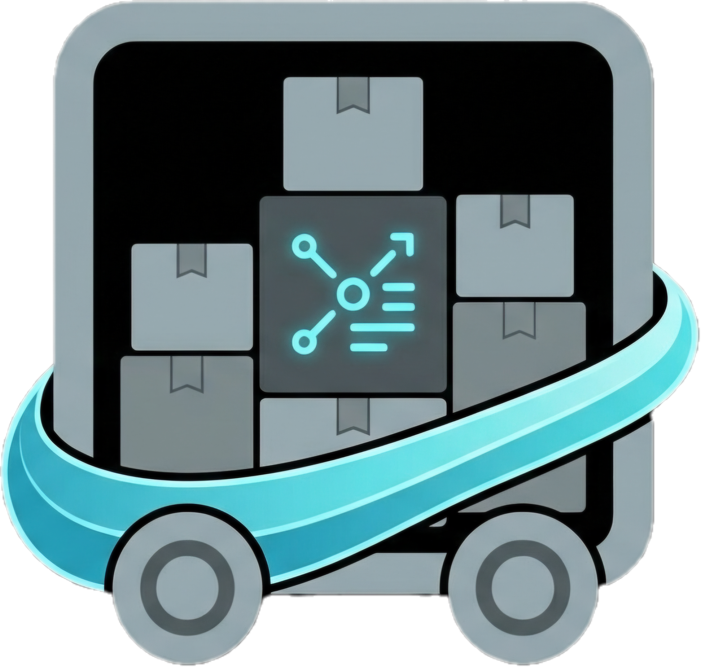

<div align="center">
  
  
  # SmartShelfKart
  **Intelligent, Cross-Platform Inventory & Stock Management**

  [](https://flutter.dev)
  [](https://firebase.google.com/)
  [](https://aistudio.google.com/)
  
  ---

  ### 🌐 [Try the Web App Live](https://smartshelfkart.com/app)
  ### 📱 [Get it on Google Play](https://play.google.com/store/apps/details?id=com.stockmanager.stock_management&pcampaignid=web_share)
  
  ---
</div>

## 📖 Overview

**SmartShelfKart** is a state-of-the-art stock and inventory management platform designed to help modern businesses track, manage, and optimize their operations. Built completely from the ground up using **Flutter** and powered by a robust **Firebase** backend, SmartShelfKart delivers blazing-fast performance across Web, Android, and iOS.

What truly sets SmartShelfKart apart is **Nova**—our integrated AI Assistant. Powered by a **LangChain & Python RAG backend** utilizing **Google Gemini**, Nova acts as an intelligent ledger that can instantly execute complex inventory commands, answer analytics questions, and assist with real-time stock adjustments through natural language.

---

## ✨ Key Features

- 🤖 **Nova AI Assistant (RAG Engine)**
  - Chat seamlessly with your inventory using natural language (supports English & Hinglish).
  - Smart intent routing instantly categorizes questions into "Analytics" vs. "Actionable Tasks".
  - Automated barcode extraction allows Nova to automatically trigger UI action cards (e.g., adding/deducting stock) directly from the chat interface without manual clicking.
  
- 📊 **Real-Time Analytics Dashboard**
  - Instantly view critical metrics: Total Products, Low Stock Alerts, Out of Stock, Pending Sales, and Purchase Orders.
  - Beautiful, dynamic charting using `fl_chart`.

- 📦 **End-to-End Inventory Control**
  - Create, manage, and categorize products with advanced SKU/Barcode tracking.
  - Set Custom Low-Stock Thresholds to proactively trigger restocking alerts.

- 🧾 **Order & Invoice Management**
  - Track complete lifecycles for **Sales Orders** and **Purchase Orders**.
  - Generate and manage professional invoices dynamically.

- 🔒 **Role-Based Access Control (RBAC)**
  - Enterprise-grade staff permissions.
  - Secure authentication flows managed by Firebase Auth.

- 🏭 **Manufacturing & Assembly**
  - Define a finished product as a bill of materials, with per-component wastage.
  - Build and unbuild in one atomic movement — components out, finished goods in, never half-done.

- 🔖 **Serial Number Tracking**
  - Track individual units below the batch, with status, location and a full movement history.
  - Warranty dates and case-insensitive lookup, for RMA and recall work.

- 🚚 **Transfer Orders with In-Transit Stock**
  - Draft → dispatched → received, with partial receipts and shortage reporting.
  - Stock in a truck sits in an explicit in-transit bucket, so totals reconcile the whole way.

- 📝 **Purchase Requisitions & Approvals**
  - Ask for stock without committing company money; approval is its own permission.
  - Approved requests convert straight into a draft purchase order.

- 🧮 **Tax (GST) Summary**
  - Output and input tax by rate for a month, quarter or financial year, with the net position.

- 🔁 **Recurring Invoices**
  - Templates on a weekly-to-yearly cadence; generating is idempotent, so nobody is billed twice.

- 💸 **Customer Price Lists**
  - Per-customer prices, blanket discounts and quantity slabs, applied in both invoicing and the POS.

- 🏷️ **Barcode & Shelf Label Printing**
  - Printable A4 label sheets with Code 128, EAN-13 or QR, in configurable grids.

- 🪦 **Dead Stock Analysis**
  - Ranks products by how long they have sat still and the capital they tie up.

- ⚓ **Landed Cost Allocation**
  - Spread freight, duty and handling across a receipt by value, quantity or evenly.
  - Applying updates cost prices and writes to Price History; reversal restores them exactly.

- 📄 **Sales Quotations**
  - Price an offer, set how long it stands, and chase it before it lapses.
  - An accepted quote converts into a sales order at the prices the customer agreed to.

- 📦 **Pick, Pack & Ship**
  - Ordered, picked and packed per line, so a short pick is caught at the bench.
  - Dispatching a shipment goes through the sales order, which is the only path that moves stock.

- 💰 **Operating Expenses**
  - Rent, wages, freight out and the rest, by head and by month.
  - Feeds the Profit & Loss report, which finally reports a net profit rather than a gross margin.

- 🧾 **Register Shifts & Cash-Up**
  - Open a till with a float, record drops and payouts, and close it on a blind count.
  - Every Fast POS sale is stamped with its shift, so the Z-report tallies what should be in the drawer.

- 🛡️ **Customer Credit Control**
  - Credit limits, payment terms and holds per customer, with live exposure from unpaid invoices.
  - Checked at the invoice screen and the till, before the credit is extended rather than after.

- 📊 **Vendor Scorecard**
  - On-time delivery, fill rate, lead time against the promise and price movement, graded A–D.
  - Built entirely from purchase orders already in the workspace.

- 🏆 **Sales Commissions**
  - Revenue or margin basis, category rates, and payment on collection rather than on issue.
  - Statements computed from the invoices, so anyone can reproduce the figure.

- 🎯 **Budgets & Variance**
  - Period budgets for revenue, purchases and each expense head, measured against actuals.
  - Pace-aware: 60% spent is fine in month eight and a problem in month two.

- 🔧 **Warranty & Service Jobs**
  - Book a unit in against its serial, diagnose it, fit parts and hand it back.
  - Parts leave stock for real, in one transaction, so a service department cannot quietly lose spares.

- 🤝 **Subcontracting (Job Work)**
  - Issue components to a vendor and hold them in an explicit *At vendor* bucket while they are away.
  - Receiving consumes them and creates finished goods costed at components plus the job charge.

---

## 🛠️ Technology Stack

### Frontend (Mobile & Web)
- **Framework:** Flutter (Dart)
- **State Management:** Provider
- **UI Architecture:** Custom Glassmorphism Theme, Responsive Layout Builder
- **AI UI:** `flutter_markdown` for beautiful tabular data rendering, `speech_to_text` for voice commands.

### Backend & Infrastructure
- **Database:** Firebase Cloud Firestore
- **Authentication:** Firebase Auth
- **Hosting:** Firebase Hosting (Web), Google Play Console (Android)
- **Storage:** Firebase Cloud Storage

### AI Microservice (`rag_backend`)
- **Framework:** Python, FastAPI, LangGraph
- **LLM:** Google Gemini, tiered by cost — `gemini-2.5-flash-lite` routes,
  `gemini-2.5-flash` reasons, `gemini-2.5-pro` opt-in for genuinely multi-step asks
- **Retrieval:** none, by design. Inventory is structured, relational, numeric
  data, so the agent **queries** it rather than embedding it — reading the row
  beats hoping cosine similarity surfaces it. See `BACKEND_ARCHITECTURE.md`.
- **Deployment:** Docker container on Google Cloud Run

### Platform & Delivery
- **Agent evaluation:** offline golden-set harness with CI gates on both
  correctness and *cost* — 21 cases, 0 tokens, no API key
- **Observability:** OpenTelemetry (GenAI semantic conventions), Prometheus
  metrics, per-turn token and cost accounting, hashed tenants
- **Integration:** Model Context Protocol server exposing the inventory to MCP
  clients, behind the same permission checks as the app
- **API contract:** OpenAPI 3.1 generated from the app, typed Dart models
  generated from that, both drift-gated in CI
- **CI/CD:** GitHub Actions — analyze, 781 Flutter tests, 19 backend suites,
  eval gate, contract gate, `pip-audit`/`npm audit`/gitleaks, Trivy image scan

📐 **[PLATFORM.md](PLATFORM.md)** covers how the agent is graded, watched and
kept honest against its client.

---

## 🚀 Getting Started

Follow these steps to run SmartShelfKart locally.

### Prerequisites
- [Flutter SDK](https://docs.flutter.dev/get-started/install) (version 3.10.7+)
- Python 3.11+ (if you wish to run the RAG backend locally)
- A Firebase Project (for Auth and Firestore setup)

### 1. Setup the Flutter Client
```bash
# Clone the repository
git clone https://github.com/himanshudixit2002/stock_management.git
cd stock_management

# Install dependencies
flutter pub get

# Run the app (Android/iOS/Web)
flutter run
```

### 2. Setup the AI Backend (Optional)
```bash
# Navigate to the backend directory
cd rag_backend

# Create and activate a virtual environment
python3 -m venv venv
source venv/bin/activate  # On Windows use `venv\Scripts\activate`

# Install requirements
pip install -r requirements.txt

# Create an environment file and add your Gemini API Key
cp .env.example .env

# Run the backend locally
uvicorn main:app --reload --port 8000
```

---

## 🤝 Contributing
Contributions are always welcome! If you have ideas for new features or find any bugs, feel free to open an issue or submit a pull request.

---

## 📄 License
This project is proprietary and built for SmartShelfKart. 

<div align="center">
  <i>Built with ❤️ using Flutter & AI</i>
</div>
